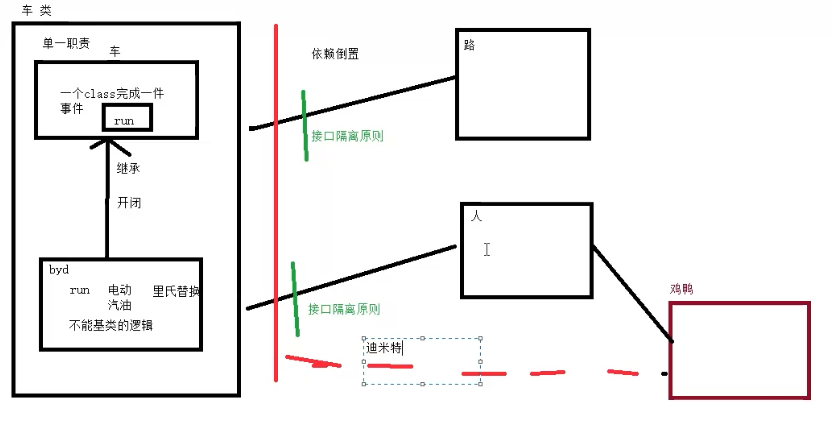

# MVVM

### 应用开发原则 - 面向对象的SOLID原则

- 单一职责原则  ：一个class完成一个事情
- 开闭原则      ：继承父类
- 里氏替换原则  ：扩展父类方法，不能改变父类逻辑
- 接口隔离原则  ：接口最小化，接口粒度尽量小
- 依赖倒置原则  ：不依赖实现，依赖接口
- 迪米特原则    ：最小支持原则

1. mvc mvp mvvm到底是什么
- 数据（model）       -> 数据+对数据进行的操作（不依赖视图的操作）
- 视图（view）        -> 不同的模式有不同的定义（xml+activity/fragment = view合集）
- 逻辑（controller）  -> view和model的通信和交互逻辑

2. 怎么演进的
- mvc相对一个文件打天下：
    >__进步：__ 抽离了model
     __缺陷：__ controller的权利太大了（activity）->什么事情都做->需求增加，actvity越来越大，越来越臃肿

- mvp相对于mvc：
    > __进步：__ activity只剩下了view，presenter承担了view和model之间的交互，满足了单一职责原则，视图数据逻辑是清晰的
      __缺陷：__ 引入了interface，方法增多，增加一个方法要修改好多地方

- mvvm：在使用的module和app的module都加入dataBinding{enabled true}
    > __viewBinding：__ 只省略了findViewById，不需要修改xml
      __dataBinding：__ 除了viewBinding的功能还能绑定data，需要修改xml

3. 在什么时候用
    > mvc 在界面简单，代码量小，逻辑简单的场景使用
      mvp -
      mvvm  核心功能复杂，需求变化快的场景
