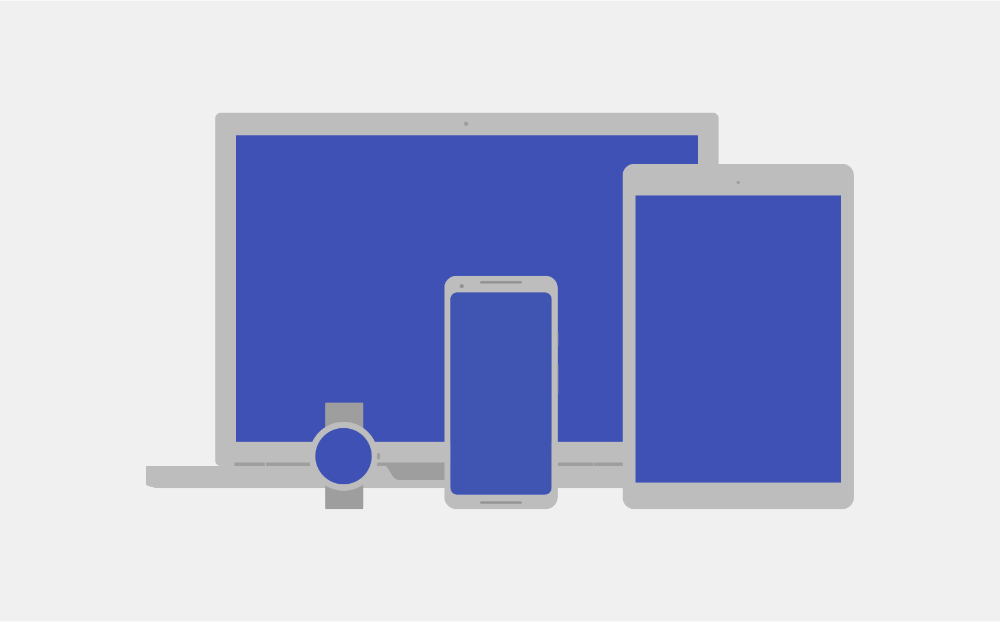
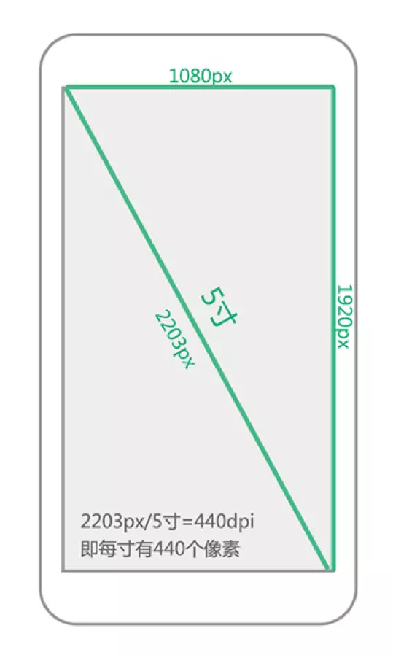
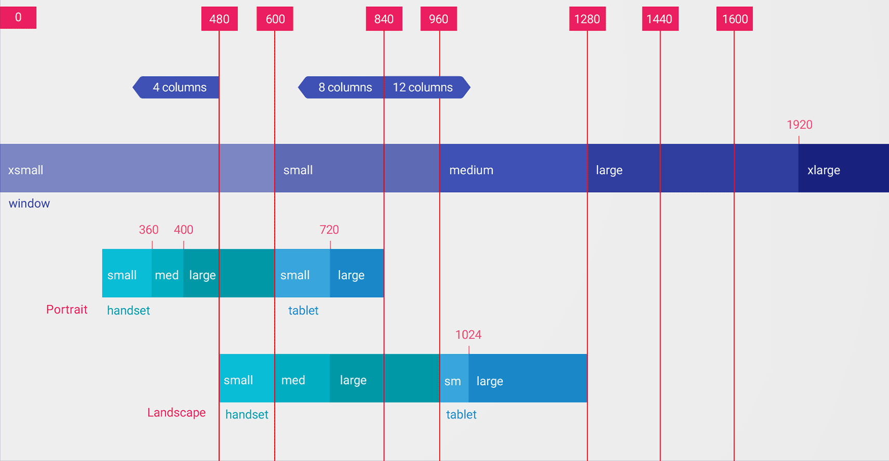
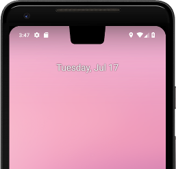
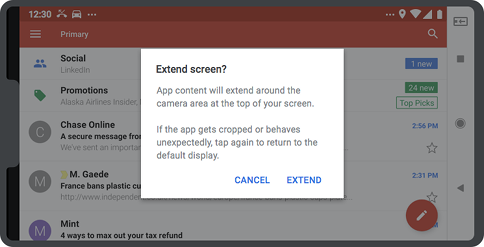
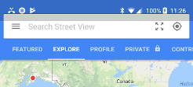
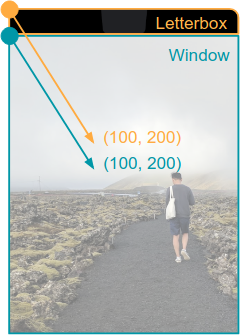
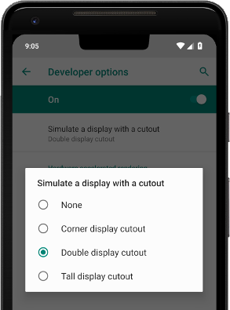

# 屏幕适配

## 为什么要适配

由于Android系统的开放性，任何用户、开发者、OEM厂商、运营商都可以对Android进行定制，于是导致运行 Android 的设备多种多样，它们有着不同的屏幕尺寸和像素密度。 尽管系统可通过基本的缩放和调整大小功能使界面适应不同屏幕，但您应做出进一步优化，以确保界面能够在各类屏幕上美观地呈现




## 几个重要的概念

## 屏幕尺寸

屏幕尺寸指屏幕的对角线的长度，单位是英寸，1英寸=2.54厘米

> 比如常见的屏幕尺寸有2.4、2.8、3.5、3.7、4.2、5.0、5.5、6.0等

### 屏幕分辨率

屏幕分辨率是指在横纵向上的像素点数，单位是px，1px=1个像素点。一般以纵向像素*横向像素，如1960\*1080。表示宽度方向上有1080个像素点，在高度方向上有1920个像素点

> 单位：px（pixel），1px=1像素点
> Android手机常见的分辨率：320x480、480x800、720x1280、1080x1920\
> UI设计师的设计图会以px作为统一的计量单位

### 屏幕像素密度

屏幕像素密度是指每英寸上的像素点数，单位是dpi，即“dot per inch”的缩写。屏幕像素密度与屏幕尺寸和屏幕分辨率有关，在单一变化条件下，屏幕尺寸越小、分辨率越高，像素密度越大，反之越小。

> 假设设备内每英寸有160个像素，那么该设备的屏幕像素密度=160dpi

安卓手机对于每类手机屏幕大小都有一个相应的屏幕像素密度：

| 密度类型             | 代表的分辨率（px） | 屏幕像素密度（dpi） |
| -------------------- | :----------------: | ------------------: |
| 低密度（ldpi）       |      240x320       |                 120 |
| 中密度（mdpi）       |      320x480       |                 160 |
| 高密度（hdpi）       |      480x800       |                 240 |
| 超高密度（xhdpi）    |      720x1280      |                 320 |
| 超超高密度（xxhdpi） |     1080x1920      |                 480 |

#### 屏幕尺寸、分辨率、像素密度三者关系

一部手机的分辨率是宽x高，屏幕大小是以寸为单位，那么三者的关系是：




### 密度无关像素

density-independent pixel，叫dp或dip，与终端上的实际物理像素点无关。可以保证在不同屏幕像素密度的设备上显示相同的效果

> Android开发时用dp而不是px单位设置图片大小，是Android特有的单位
>
> 场景：假如同样都是画一条长度是屏幕一半的线，如果使用px作为计量单位，那么在480x800分辨率手机上设置应为240px；在320x480的手机上应设置为160px，二者设置就不同了；如果使用dp为单位，在这两种分辨率下，160dp都显示为屏幕一半的长度。

#### dp与px的转换

px = dp * (dpi / 160)

| 密度类型             | 代表的分辨率（px） | 屏幕密度（dpi） | 换算（px/dp） | 比例 |
| -------------------- | ------------------ | --------------- | ------------- | ---- |
| 低密度（ldpi）       | 240x320            | 120             | 1dp=0.75px    | 3    |
| 中密度（mdpi）       | 320x480            | 160             | 1dp=1px       | 4    |
| 高密度（hdpi）       | 480x800            | 240             | 1dp=1.5px     | 6    |
| 超高密度（xhdpi）    | 720x1280           | 320             | 1dp=2px       | 8    |
| 超超高密度（xxhdpi） | 1080x1920          | 480             | 1dp=3px       | 12   |

在Android中，规定以160dpi（即屏幕分辨率为320x480）为基准：1dp=1px

### 独立比例像素

sp，即scale-independent pixels，与dp类似，但是可以根据文字大小首选项进行放缩，是设置字体大小的御用单位。

## 解决方案

### 使用备用布局 -使用限定符

- 尺寸（size）限定符
- 使用最小宽（Smallest-width）度限定符
- 布局别名
- 屏幕方向（Orientation）限定符

#### 详情

###### 使用最小宽度限定符

使用“最小宽度”屏幕尺寸限定符，您可以为具有最小宽度（以[密度无关像素](https://developer.android.com/training/multiscreen/screendensities?hl=zh-cn#TaskUseDP) dp 或 dip 为度量单位）的屏幕提供备用布局。

通过将屏幕尺寸描述为密度无关像素的度量值，Android 允许您创建专为非常具体的屏幕尺寸而设计的布局，同时让您不必对不同的像素密度有任何担心。

例如，您可以创建一个名为 `main_activity` 且针对手机和平板电脑进行了优化的布局，方法是在目录中创建该文件的不同版本，如下所示：

```
    res/layout/main_activity.xml           # For handsets (smaller than 600dp available width)
    res/layout-sw600dp/main_activity.xml   # For 7” tablets (600dp wide and bigger)
    
```

最小宽度限定符指定屏幕两侧的最小尺寸，而不考虑设备当前的屏幕方向，因此这是一种指定布局可用的整体屏幕尺寸的简单方法。

下面是其他最小宽度值与典型屏幕尺寸的对应关系：

- 320dp：典型手机屏幕（240x320 ldpi、320x480 mdpi、480x800 hdpi 等）。
- 480dp：约为 5 英寸的大手机屏幕 (480x800 mdpi)。
- 600dp：7 英寸平板电脑 (600x1024 mdpi)。
- 720dp：10 英寸平板电脑（720x1280 mdpi、800x1280 mdpi 等）。

图 4 提供了一个更详细的视图，说明了不同屏幕 dp 宽度与不同屏幕尺寸和方向的一般对应关系。



**图 4.** 建议的宽度断点以支持不同的屏幕尺寸


请记住，最小宽度限定符的所有数值都是[密度无关像素](https://developer.android.com/guide/practices/screens_support?hl=zh-cn#density-independence)，因为重要的是系统考虑像素密度（而不是原始像素分辨率）之后可用的屏幕空间量。

**注意**：您使用这些限定符指定的尺寸**不是实际屏幕尺寸**，而是 **Activity 窗口可用**的宽度或高度（以 dp 为单位）。Android 系统可能会将部分屏幕用于系统界面（如屏幕底部的系统栏或顶部的状态栏），因此部分屏幕可能不可供您的布局使用。如果您的应用在[多窗口模式](https://developer.android.com/guide/topics/ui/multi-window?hl=zh-cn)下使用，则它只能使用该窗口的尺寸。对该窗口进行大小调整时，它会使用新窗口尺寸触发[配置更改](https://developer.android.com/guide/topics/resources/runtime-changes?hl=zh-cn)，以便系统可以选择适当的布局文件。因此，在声明尺寸时，您应具体说明 Activity 需要的尺寸。在声明为布局提供的空间时，系统会考虑系统界面使用的所有空间。

###### 使用可用宽度限定符

您可能希望根据当前可用的宽度或高度来更改布局，而不是根据屏幕的最小宽度来更改布局。例如，如果您有一个双窗格布局，您可能希望在屏幕宽度至少为 600dp 时使用该布局，但屏幕宽度可能会根据设备的屏幕方向是横向还是纵向而发生变化。在这种情况下，您应使用“可用宽度”限定符，如下所示：

```
    res/layout/main_activity.xml         # For handsets (smaller than 600dp available width)
    res/layout-w600dp/main_activity.xml  # For 7” tablets or any screen with 600dp
                                         #   available width (possibly landscape handsets)
    
```

如果您关心可用高度，则可以使用“可用高度”限定符来执行相同的操作。例如，对于屏幕高度至少为 600dp 的屏幕，请使用限定符 `layout-h600dp`。

###### 添加屏幕方向限定符

虽然您可能只需将“最小宽度”和“可用宽度”限定符结合使用即可支持所有尺寸变化，但是您可能还希望当用户在纵向与横向之间切换屏幕方向时改变用户体验。

为此，您可以将 `port` 或 `land` 限定符添加到资源目录名称中。只需确保这些限定符在其他尺寸限定符后面即可。例如：

```
    res/layout/main_activity.xml                # For handsets
    res/layout-land/main_activity.xml           # For handsets in landscape
    res/layout-sw600dp/main_activity.xml        # For 7” tablets
    res/layout-sw600dp-land/main_activity.xml   # For 7” tablets in landscape
    
```

如需详细了解所有屏幕配置限定符，请参阅[提供资源](https://developer.android.com/guide/topics/resources/providing-resources?hl=zh-cn)指南中的表 2。

###### 使用 Fragment 将界面组件模块化

在针对多种屏幕尺寸设计应用时，您希望确保不会在 Activity 之间不必要地重复界面行为。因此，您应该使用 [Fragment](https://developer.android.com/guide/components/fragments?hl=zh-cn) 将界面逻辑提取到单独的组件中。然后，您可以组合 Fragment 以便在大屏幕设备上运行时创建多窗格布局，或者在手机上运行时将 Fragment 放置在单独的 Activity 中。

例如，平板电脑上的一款新闻应用可能在左侧显示报道列表，而在右侧显示一篇完整的报道。在左侧选择一篇报道时，会更新右侧的报道视图。但是，在手机上，这两个组件应显示在单独的屏幕上。从列表中选择一篇报道时，会改变整个屏幕以显示这篇报道。

如需了解详情，请参阅[使用 Fragment 构建动态界面](https://developer.android.com/training/basics/fragments?hl=zh-cn)。

###### 使用旧尺寸限定符支持 Android 3.1

如果您的应用支持 Android 3.1（API 级别 12）或更低版本，则除上面的最小/可用宽度限定符之外，您还需要使用[旧尺寸限定符](https://developer.android.com/guide/topics/resources/providing-resources?hl=zh-cn#ScreenSizeQualifier)。

在上面的示例中，如果要在较大的设备上显示双窗格布局，那么您需要使用“large”配置限定符来支持 3.1 及更低版本。因此，要在这些旧版本上实现此类布局，您可能需要创建以下文件：

```
    res/layout/main_activity.xml           # For handsets (smaller than 640dp x 480dp)
    res/layout-large/main_activity.xml     # For small tablets (640dp x 480dp and bigger)
    res/layout-xlarge/main_activity.xml    # For large tablets (960dp x 720dp and bigger)
    
```

###### 使用布局别名

如果同时支持低于和高于 Android 3.2 的版本，您必须同时对布局使用最小宽度限定符和“large”限定符。因此，您应创建一个名为 `res/layout-large/main.xml` 的文件，该文件可能与 `res/layout-sw600dp/main.xml` 完全相同。

为避免同一文件出现这种重复，您可以使用别名文件。例如，您可以定义以下布局：

```
    res/layout/main.xml            # single-pane layout
    res/layout/main_twopanes.xml   # two-pane layout
    
```

并添加以下两个文件：


- ```
  res/values-large/layout.xml
  ```

  ：

  ```xml
      <resources>
          <item name="main" type="layout">@layout/main_twopanes</item>
      </resources>
      
  ```

- ```
  res/values-sw600dp/layout.xml
  ```

  ：

  ```xml
      <resources>
          <item name="main" type="layout">@layout/main_twopanes</item>
      </resources>
      
  ```


这两个文件的内容完全相同，但它们实际上并未定义布局，而只是将 `main` 设置为 `main_twopanes` 的别名。由于这些文件具有 `large` 和 `sw600dp` 选择器，因此它们适用于任何 Android 版本的平板电脑和电视（低于 3.2 版本的平板电脑和电视与 `large` 匹配，高于 3.2 版本者将与 `sw600dp` 匹配）。

## 创建可拉伸的九宫格位图

如果您在改变尺寸的视图中将位图用作背景，您会注意到，当视图根据屏幕尺寸或视图中的内容增大或缩小时，Android 会缩放您的图片。这通常会导致明显的模糊或其他缩放失真。解决方案是使用九宫格位图，这种特殊格式的 PNG 文件会指示哪些区域可以拉伸，哪些区域不可以拉伸。

九宫格位图基本上是一种标准的 PNG 文件，但带有额外的 1 像素边框，指示应拉伸哪些像素（并且带有 `.9.png` 扩展名，而不只是 `.png`）。如图 5 中所示，左边缘和上边缘的黑线之间的交点是可以拉伸的位图区域。

或者，您也可以定义内容在视图内应进入的安全区域，方法是以同样的方式在右边缘和下边缘添加线条。


**图 5.** 九宫格图片 (`button.9.png`)


将九宫格作为背景应用于视图时，框架会正确拉伸图片以适应按钮的尺寸。

如需根据位图创建九宫格图片方面的帮助，请参阅[创建可调整大小的位图](https://developer.android.com/studio/write/draw9patch?hl=zh-cn)。

## 针对所有屏幕尺寸进行测试

务必针对各种屏幕尺寸测试您的应用，以便确保界面正确缩放。如果您无法访问具有各种不同屏幕尺寸的物理设备，则可以使用 [Android 模拟器](https://developer.android.com/studio/run/emulator?hl=zh-cn)模拟任何屏幕尺寸。

如果您希望在物理设备上进行测试，但又不想购买设备，则可以使用 [Firebase 测试实验室](https://firebase.google.com/docs/test-lab/?hl=zh-cn)访问 Google 数据中心内的设备。

## 声明特定的屏幕尺寸支持

如果您不想让您的应用以特定的屏幕尺寸运行，您可以设置屏幕尺寸限制，甚至可以根据设备的屏幕配置限制哪些设备可以安装您的应用。如需了解详情，请参阅[声明受限屏幕支持](https://developer.android.com/guide/practices/screens-distribution?hl=zh-cn)。

### 支持刘海屏




刘海屏是指某些设备显示屏上的一个区域延伸到显示面，这样既能为用户提供全面屏体验，又能为设备正面的重要传感器留出空间。Android 在搭载 Android 9（API 级别 28）及更高版本的设备上正式支持刘海屏。请注意，设备制造商也可以选择在搭载 Android 8.1 或更低版本的设备上支持刘海屏。

本主题介绍如何实现对带刘海屏的设备的支持，包括如何处理“刘海区域”，即显示面上包含刘海的无边框矩形。

###### 在带刘海屏的设备上有什么要求

为了确保一致性和应用兼容性，搭载 Android 9 的设备必须确保以下刘海行为：

- 一条边缘最多只能包含一个刘海。
- 一台设备不能有两个以上的刘海。
- 设备的两条较长边缘上不能有刘海。
- 在未设置特殊标志的竖屏模式下，状态栏的高度必须至少与刘海的高度持平。
- 默认情况下，在全屏模式或横屏模式下，整个刘海区域必须显示黑边。

###### 选择您的应用如何处理刘海区域

如果不希望您的内容与刘海区域重叠，请确保您的内容不与状态栏和导航栏重叠，这样做一般就足够了。如果您要将内容呈现到刘海区域中，则可以使用 [WindowInsets.getDisplayCutout()](https://developer.android.com/reference/android/view/WindowInsets?hl=zh-cn#getDisplayCutout()) 来检索 [DisplayCutout](https://developer.android.com/reference/android/view/DisplayCutout?hl=zh-cn) 对象，该对象包含每个刘海区域的安全边衬区和边界框。您可以使用这些 API 来检查您的内容是否与刘海区域重叠，以便根据需要重新放置。

**注意**：要在多个 API 级别管理刘海实现，您还可以使用 [AndroidX 库](https://developer.android.com/topic/libraries/support-library/androidx-overview?hl=zh-cn)（可通过 SDK 管理器获得）中的 [DisplayCutoutCompat](https://developer.android.com/reference/androidx/core/view/DisplayCutoutCompat?hl=zh-cn)。

Android 还允许您控制是否在刘海区域内显示内容。窗口布局属性 [layoutInDisplayCutoutMode](https://developer.android.com/reference/android/view/WindowManager.LayoutParams?hl=zh-cn#layoutInDisplayCutoutMode) 控制您的内容如何呈现在刘海区域中。您可以将 `layoutInDisplayCutoutMode` 设为以下某个值：

- [LAYOUT_IN_DISPLAY_CUTOUT_MODE_DEFAULT](https://developer.android.com/reference/android/view/WindowManager.LayoutParams?hl=zh-cn#LAYOUT_IN_DISPLAY_CUTOUT_MODE_DEFAULT) - 这是默认行为，如上所述。在竖屏模式下，内容会呈现到刘海区域中；但在横屏模式下，内容会显示黑边。
- [LAYOUT_IN_DISPLAY_CUTOUT_MODE_SHORT_EDGES](https://developer.android.com/reference/android/view/WindowManager.LayoutParams?hl=zh-cn#LAYOUT_IN_DISPLAY_CUTOUT_MODE_SHORT_EDGES) - 在竖屏模式和横屏模式下，内容都会呈现到刘海区域中。
- [LAYOUT_IN_DISPLAY_CUTOUT_MODE_NEVER](https://developer.android.com/reference/android/view/WindowManager.LayoutParams?hl=zh-cn#LAYOUT_IN_DISPLAY_CUTOUT_MODE_NEVER) - 内容从不呈现到刘海区域中。

您可以通过编程或在 Activity 中设置样式来设置刘海模式。以下示例定义了一种[样式](https://developer.android.com/guide/topics/ui/look-and-feel/themes?hl=zh-cn)，您可以使用它将 `LAYOUT_IN_DISPLAY_CUTOUT_MODE_SHORT_EDGES` 属性应用到 Activity。

```xml
    <style name="ActivityTheme">
      <item name="android:windowLayoutInDisplayCutoutMode">
        shortEdges <!-- default, shortEdges, never -->
      </item>
    </style>
    
```

下面几部分更详细地介绍了不同的刘海模式。

###### 默认行为

默认情况下，在未设置特殊标志的竖屏模式下，在带刘海屏的设备上，状态栏的大小会调整为至少与刘海一样高，而您的内容会显示在下方区域。在横屏模式或全屏模式下，您的应用窗口会显示黑边，因此您的任何内容都不会显示在刘海区域中。

###### 将内容呈现在短边刘海区域中

对于某些内容（如视频、照片、地图和游戏），呈现在刘海区域中是一种很好的方法，这样能够为用户提供沉浸感更强的全面屏体验。如果设置了 [LAYOUT_IN_DISPLAY_CUTOUT_MODE_SHORT_EDGES](https://developer.android.com/reference/android/view/WindowManager.LayoutParams?hl=zh-cn#LAYOUT_IN_DISPLAY_CUTOUT_MODE_SHORT_EDGES)，则在竖屏模式和横屏模式下，内容都会延伸到显示屏的短边上的刘海区域，而不管系统栏处于隐藏还是可见状态。请注意，窗口无法延伸到屏幕的长边上的刘海区域。使用此模式时，请确保没有重要内容与刘海区域重叠。

请注意，Android 可能不允许内容视图与系统栏重叠。要替换此行为并强制内容延伸到刘海区域，请通过 [View.setSystemUiVisibility(int)](https://developer.android.com/reference/android/view/View?hl=zh-cn#setSystemUiVisibility(int)) 方法将以下任一标志应用于视图可见性：

- SYSTEM_UI_FLAG_LAYOUT_FULLSCREEN
- SYSTEM_UI_FLAG_LAYOUT_HIDE_NAVIGATION
- SYSTEM_UI_FLAG_LAYOUT_STABLE

下面是一些 `LAYOUT_IN_DISPLAY_CUTOUT_MODE_SHORT_EDGES` 示例：


请注意，边角处的刘海可等同于在短边上，因此适用同样的行为：


###### 从不将内容呈现在刘海区域中

如果设置了 [LAYOUT_IN_DISPLAY_CUTOUT_MODE_NEVER](https://developer.android.com/reference/android/view/WindowManager.LayoutParams?hl=zh-cn#LAYOUT_IN_DISPLAY_CUTOUT_MODE_NEVER)，则不允许窗口与刘海区域重叠。

此模式应该用于暂时设置 [View.SYSTEM_UI_FLAG_FULLSCREEN](https://developer.android.com/reference/android/view/View?hl=zh-cn#SYSTEM_UI_FLAG_FULLSCREEN) 或 [View.SYSTEM_UI_FLAG_HIDE_NAVIGATION](https://developer.android.com/reference/android/view/View?hl=zh-cn#SYSTEM_UI_FLAG_HIDE_NAVIGATION) 的窗口，以避免在设置或清除了该标志时执行另一种窗口布局。

###### 特殊模式

某些搭载 Android 8.1（API 级别 27）或更低版本的设备支持一种特殊模式，可让用户将显示黑边的全屏或横屏应用延伸到刘海区域。此模式通常使用导航栏中的切换开关来控制，在延伸屏幕之前会显示一个对话框，要求用户进行确认。



###### 支持刘海屏的最佳做法

使用[刘海屏](https://developer.android.com/guide/topics/display-cutout?hl=zh-cn)时，请务必考虑以下几点：

- 不要让刘海区域遮盖任何重要的文本、控件或其他信息。

- 不要将任何需要精细轻触识别的交互式元素放置或延伸到刘海区域。刘海区域中的轻触灵敏度可能要比其他区域低一些。

- 避免对状态栏高度进行硬编码，因为这样做可能会导致内容重叠或被切断。如有可能，请使用 [WindowInsetsCompat](https://developer.android.com/reference/androidx/core/view/WindowInsetsCompat?hl=zh-cn) 检索状态栏高度，并确定要对您的内容应用的适当内边距。

  

- 不要假定应用会占据整个窗口，而应使用 [View.getLocationInWindow()](https://developer.android.com/reference/android/view/View?hl=zh-cn#getLocationInWindow(int[])) 来确认应用的位置。不要使用 [View.getLocationOnScreen()](https://developer.android.com/reference/android/view/View.?hl=zh-cn#getLocationOnScreen(int[]))。

- 务必妥善处理进入或退出全屏模式。请阅读[这篇 Android 开发者博文](https://android-developers.googleblog.com/2017/12/tuning-your-apps-and-games-for-long.html)。

- 对于竖屏模式下的默认刘海行为，如果刘海区域位于顶部边缘，并且窗口未设置 [FLAG_FULLSCREEN](https://developer.android.com/reference/android/view/WindowManager.LayoutParams?hl=zh-cn#FLAG_FULLSCREEN) 或 [View.SYSTEM_UI_FLAG_FULLSCREEN](https://developer.android.com/reference/android/view/View?hl=zh-cn#SYSTEM_UI_FLAG_FULLSCREEN)，则窗口可以延伸到刘海区域。同样，如果刘海区域位于底部边缘，并且窗口未设置 [View.SYSTEM_UI_FLAG_HIDE_NAVIGATION](https://developer.android.com/reference/android/view/View?hl=zh-cn#SYSTEM_UI_FLAG_HIDE_NAVIGATION)，则窗口可以延伸到刘海区域。在全屏模式或横屏模式下，窗口的布局方式应确保其不与刘海区域重叠。

- 如果您的应用需要进入和退出全屏模式，请使用 `shortEdges` 或 `never` 刘海模式。默认刘海行为可导致应用中的内容在全屏模式转换过程中上下移动

- 在全屏模式下，在使用窗口坐标与屏幕坐标时应保持谨慎，因为在显示黑边的情况下，您的应用不会占据整个屏幕。由于显示黑边，因此根据屏幕原点得到的坐标与根据窗口原点得到的坐标不再相同。您可以根据需要使用 [getLocationOnScreen()](https://developer.android.com/reference/android/view/View?hl=zh-cn#getLocationOnScreen(int[])) 将屏幕坐标转换为视图坐标。下图展示了内容显示黑边时这两种坐标有何不同：

  

  处理 `MotionEvent` 时，请使用 [MotionEvent.getX()](https://developer.android.com/reference/android/view/MotionEvent?hl=zh-cn#getX()) 和 [MotionEvent.getY()](https://developer.android.com/reference/android/view/MotionEvent?hl=zh-cn#getY()) 来避免类似的坐标问题。不要使用 [MotionEvent.getRawX()](https://developer.android.com/reference/android/view/MotionEvent?hl=zh-cn#getRawX()) 或 [MotionEvent.getRawY()](https://developer.android.com/reference/android/view/MotionEvent?hl=zh-cn#getRawY())。

###### 测试您的内容如何呈现



请务必测试应用的所有屏幕和体验。如有可能，在具有不同类型刘海屏的设备上进行测试。如果您没有带刘海屏的设备，可以在搭载 Android 9 的任意设备或模拟器上模拟一些常见的刘海配置，具体操作步骤如下：

1. 启用[开发者选项](https://developer.android.com/studio/debug/dev-options?hl=zh-cn)。
2. 在**开发者选项**屏幕中，向下滚动到绘制部分，然后选择模拟刘海屏。
3. 选择刘海类型。


### 布局选择

- 线性布局（Linearlayout）
- 相对布局（RelativeLayout推荐）
- 帧布局（FrameLayout）
- 绝对布局（AbsoluteLayout禁用）
- 约束布局 （Constraintlayout推荐）

### 使用自适应尺寸

- wrap_content,match_parent,weight, dp, 0dp
- 不要使用px

### 今日头条适配方案

`px值 = dp值 * metrics.density`，这里的`density`是指的手机的屏幕密度，由系统提供，不同的手机的`density`可能不同；所以我们不能直接使用系统的`density`，需要篡改`density`来达到适配的目的

### 百分比适配

1. 以某一分辨率为基准，生成所有分辨率对应像素数列表
2. 将生成像素数列表存放在res目录下对应的values文件下
3. 根据UI设计师给出设计图上的尺寸，找到对应像素数的单位，然后设置给控件即可


