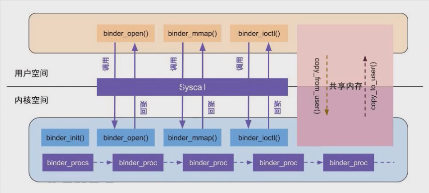

# Binder 
Binder是什么
* 进程间通信机制
* 也是一个驱动
* Binder.java -> 实现 iBinder接口 --- 跨进程能力

### 多进程通信eg:
>自己创建的进程的：webView 视频播放，音乐播放，大图浏览，推送
>系统服务： 打电话，闹钟，AMS等等

### 多进程通信优点：
>内存：单个进程（单个jvm）分配的内存有限，一个app开启多个进程，可以扩大内存占用
>安全隔离：风险隔离，危险操作放到单独进程中

### Binder与传统IPC对比
    对比linux进程通信机制：管道、信号量、socket、共享内存
    binder性能 < 共享内存，但是优于其他IPC进程间通信
    
    1.binder只用拷贝一次数据；共享内存不用拷贝；socket需要拷贝两次
    2.binder基于c/s架构，易用性高；共享内存存在数据同步问题，控制复杂，
        易用性差；socket基于c/s架构，但是作为通用接口，传输效率低，开销大
    3.binder为每个APP分配单独UID，同时支持实名和匿名

* Binder如何做到一次拷贝

### 进程间内存隔离，详细内存划分
    内存被操作系统划分成两块：用户空间和内核空间，用户空间是用户程序代码运行的地方，
    内核空间是内核代码运行的地方。为了安全，它们是隔离的，即使用户的程序崩溃了，内核也不受影响。

### mmap的原理讲解
    Linux通过将一个虚拟内存区域与一个磁盘上的对象关联起来，以初始化这个虚拟内存区域的内容，
    这个过程称为内存映射(memory mapping)。

### Binder启动流程

    1. binder_init
        1.分配内存
        2.初始化设备
        3.放入链表 binder——devices
    
    2. binder_open
        1.创建binder_proc对象
        2.当前进程信息保存到proc
        3.filp->private_data = proc;
        4.添加到binder_procs链表中
    
    3. binder_mmap
        1.通过用户空间的虚拟内存大小 --- 分配一块内核的虚拟内存
        2.分配一块物理内存 --- 4KB
        3.把这块物理内存分别映射到 用户空间的虚拟内存和内核的虚拟内存
    
    4. binder_ioctl
        读写操作---BINDER_WRITE_READ---> 
        binder_ioctl_write_read() { 
            copy_from_user() // 从用户空间拷贝到内核
    
            copy_to_user() // 从内核拷贝到用户空间
    
            binder_thread_write()
            binder_thread_read()
        }

### Binder在JNI层注册
    init.zygote32.rc ---> app_main.cpp.main() ---> AndroidRuntime.start() 
    ---> startReg(JNIEnv* env) ---> register_jni_procs(gRegJNI, NELEM(gRegJNI), env) 
    ---> REG_JNI(register_android_os_Binder) ---> andorid_util_Binder.cpp  int_register_android_os_Binder()

目的：java和native能够互相调用

---

### 1. ServiceManager注册

1. system/core/rootdir/init.rc --->

service servicemanager /system/bin/servicemanager
    class core
    user system
    group system
    critical
    onrestart restart healthd
    onrestart restart zygote
    onrestart restart media
    onrestart restart surfaceflinger
    onrestart restart drm
--->
（源码见 native/cmds/servicemanager/service_manager.c.main()
    1. 打开驱动，内存映射 128kb大小
        binder_open()
    2. 设置serviceManager管理系统服务
        binder_becom_context_manager()

        1.创建binder_node结构体对象
        2.proc -> binder_node
        3.创建work和todo消息队列
    
    3. binder_loop()
    BC_ENTER_LOOPER
        1.写入状态为Loop
        2.去读数据：

2. ServiceManager获取（native层）

    调用sm的情况：
    1.注册服务到sm
    2.通过sm去获取服务--java

native/libs/binder/IServiceManager.cpp.defaultServiceManager()
    1.ProcessState::seft()->
        1.打开驱动：binder
        2.设置线程最大数目15
        3.mmap ---设置共享内存大小--- 1M-8k 

    2.getContextObject(NULL)->
        getStrongProxyForHandle(0)->
        创建BpBinder() --- 客户端对象 代理BBinder
    3.interface_cast()
        1.new BpServiceManager(new BpBinder)
        2.remote.transact() -> 远程调用
        3.remote==BpBinder
    4.java层
        1.new ServiceManagerProxy(new BinderProxy)
        2.mRemote = BpBinder
        3.BinderProxy.mObject == BpBinder
        4.mRemote.transact == BpBinder.transact

AIDL

---

# 服务的注册和获取，线程池管理
    ——从java获取

framework/base/services/java/com/android/server/SystemServer.java

main() -> 
    SystemServer.run() ->
        startBootstrapServices() ->
            AMS -> 反射 -> systemServiceManager.startService() -> Lifecycle -> service.start()
                -> AMS.setSystemProcess() -> ServiceManager.addService() ->
                     getIServiceManager().addService(name, service, false)

* getIServiceManager().addService(name, service, false);

    * getIServiceManager() ---> return ServiceManagerProxy(BinderProxy)
        * ServiceManagerNative.asInterface(BinderInternal.getContextObject())
            * BinderInternal.getContextObject() -> 调用native return BinderProxy对象
                * android_util_Binder.cpp
                * ProcessState::self()->getContextObject:创建一个BpBinder
                    * javaObjectForIBinder->BinderProxy和BpBinder互相绑定
            * ServiceManagerNative.asInterface()
                * return ServiceManagerProxy(BinderProxy)

    * addService()

        * data.writeStrongBinder(service); (service:AMS)  将AMS放入data中

        * mRemote.transact() -> BinderProxy.transact()

            * BpBinder.transact() -> IPCThreadState::transact()

                1. witeTransactionData ---out写入命令 -write -cmd ==BC_TRANSACTION

                2. waitForResponse() --->  talkWithDriver() !重点kernel/drivers/staging/android/binder.c/binder_transaction()

                    1. 获取target_node

                    2. 获取target_proc

                    3. 获取todo, wait

                    4. 创建t，tcomplete

                    5. 拷贝数据

                    6. binder_transaction_binder 转化--> handle

                    7. thread->transaction_stack = t; 方便sm找到客户端

                    8. t->work.type = BINDER_WORK_TRANSACTION; ->给SM 执行

                    9. tcomplete->type = BINDER_WORK_TRANSACTION_COMPLETE;给client挂起

                    10. wake_up_interruptible(target_wait); 唤醒sm

                        

### 总结：

